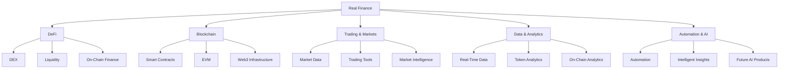

# ⚡ Real Finance

### Building the infrastructure for the next generation of decentralized finance.

<p align="center">
  
</p>

<p align="center">
  <b>DeFi • Blockchain • Trading • Data • Automation</b>
</p>

---

## 🌐 About Real Finance

**Real Finance** is a technology organization focused on building innovative products across **Web3, DeFi, blockchain infrastructure, financial data, and decentralized trading**.

We combine blockchain technology, real-time data, analytics, and automation to create products that make decentralized financial markets more transparent, accessible, and intelligent.

Our goal is simple:

> **Build powerful financial technology for the decentralized economy.**

---

## 🚀 Our Ecosystem



---

## 📊 Featured Project

### 🔥 ThetaScreener

**ThetaScreener** is a DeFi platform built on the **Theta blockchain**, designed to provide real-time decentralized exchange data, token analytics, market insights, and trading tools.

We are building an experience that brings together:

* 📈 Real-time DEX data
* 🔎 Token discovery & analytics
* 💱 Trading intelligence
* ⛓️ On-chain data
* 📊 Market insights
* ⚡ Real-time monitoring
* 🤖 Automation & future AI capabilities

The vision is to make blockchain market data easier to understand and more useful for **traders, investors, developers, and Web3 users**.

---

## 🧠 Technology

We work across modern technologies including:

<p align="center">


</p>

### Core Areas

| Area           | Technologies                               |
| -------------- | ------------------------------------------ |
| Frontend       | React, TypeScript, JavaScript              |
| Backend        | Node.js, NestJS                            |
| Database       | PostgreSQL                                 |
| Blockchain     | EVM, Solidity, Smart Contracts             |
| Web3           | Wallets, DEX, On-chain Data                |
| Infrastructure | Docker, Cloud, APIs                        |
| Data           | Real-time APIs, Blockchain Data, Analytics |
| Development    | Git, GitHub, CI/CD                         |

---

## 🏗️ What We're Building

```text
                         REAL FINANCE
                              │
          ┌───────────────────┼───────────────────┐
          │                   │                   │
        DeFi              Blockchain          Data
          │                   │                   │
       Trading           Smart Contracts      Analytics
          │                   │                   │
        DEX Data          EVM / Web3         Real-Time
          │                   │                   │
          └───────────────────┼───────────────────┘
                              │
                       Intelligent
                         Finance
```

Our products are designed around three principles:

### ⚡ Real-Time

Financial markets move quickly. Our systems are designed around fast, actionable market information.

### 🔗 Decentralized

We build with blockchain technology at the core — leveraging transparent, permissionless, and programmable financial infrastructure.

### 🧠 Intelligent

We combine data, analytics, automation, and AI-oriented technologies to turn complex blockchain activity into useful insights.

---

## 🔐 Engineering Principles

We believe great Web3 infrastructure should be:

* **Secure by design**
* **Scalable**
* **Observable**
* **Data-driven**
* **Developer-friendly**
* **Open to innovation**

Security and reliability are fundamental to everything we build.

---

## 👨‍💻 Join Us

We are always interested in connecting with talented people working in:

**Engineering**

* Full-Stack Development
* Frontend Engineering
* Backend Engineering
* Blockchain Engineering
* Smart Contracts

**Product & Data**

* Product Management
* Data Engineering
* Data Analytics
* Quantitative Research
* AI / Automation

**Web3**

* DeFi
* DEX
* EVM
* Smart Contracts
* Blockchain Infrastructure

---

## 🌍 Remote & Global

We work with talented people from around the world.

Our development environment is designed for **remote collaboration, asynchronous work, and open technical communication**.

---

## 📌 Our Mission

> **Make decentralized financial markets easier to access, understand, and build on.**

We are building the technology layer that connects **blockchain data, decentralized markets, trading intelligence, and automation**.

---

<p align="center">
  
</p>

<p align="center">
  <b>REAL FINANCE</b><br/>
  <sub>Building the future of decentralized finance.</sub>
</p>
